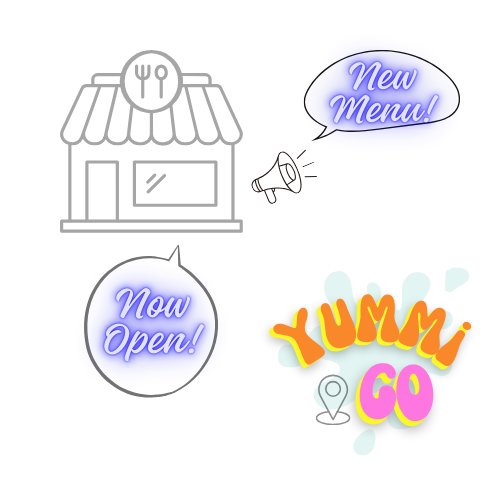

✨ Discover and go eat! ✨

This Yummi-Go is a platform where foodies around the world can meet their favorite eateries easily and restaurant owners' can reach their customers effortlessly.

---

## Technologies Used
- backend: FastAPI, Strawberry GraphQL, PostgreSQL
- web-frontend: React
- mobile-app: React Native
- database: SQLAlchemy
- authentication: JWT
- deployment: Fly.io

---

## Features

As a foodie
- sign up
- search an eatery (based on favorite food)
- get direction
- share picture/vdo on social media
- leave a review
- subscribe to new eatery in town, new menu, promotions, and more

As an eatery
- sign up
- take reservations
- announce new items, promotions, and more to subscribers
- reply to reviews
  
